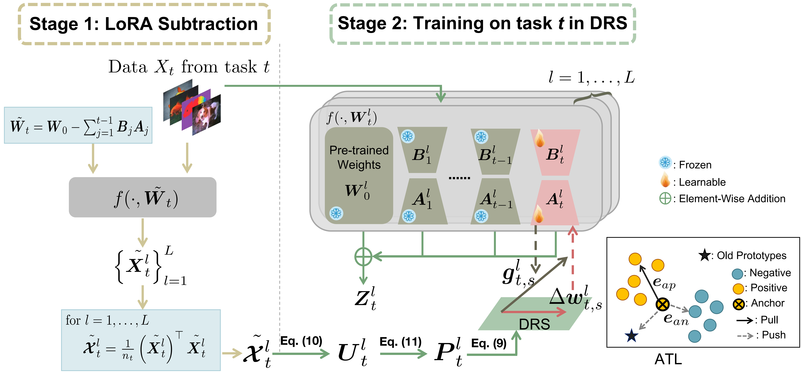

# LoRA Subtraction for Drift-Resistant Space in Exemplar-Free Continual Learning

This repository contains the official implementation of our CVPR 2025 paper, "LoRA Subtraction for Drift-Resistant Space in Exemplar-Free Continual Learning."



## 1.Requisite

This code is implemented in PyTorch, and we perform the experiments under the following environment settings:

- python = 3.11.4
- torch = 2.0.1
- torchvision = 0.15.2
- timm = 0.6.7

The code has been tested on Linux Platform with a GPU (RTX3080 Ti).

If you see the following error, you may need to install a PyTorch package compatible with your infrastructure.

```
RuntimeError: No HIP GPUs are available or ImportError: libtinfo.so.5: cannot open shared object file: No such file or directory
```

For example if your infrastructure only supports CUDA == 11.1, you may need to install the PyTorch package using CUDA11.1.

```
pip install torch==1.9.0+cu111 torchvision==0.10.0+cu111 torchaudio==0.9.0 -f https://download.pytorch.org/whl/torch_stable.html
```

If you see the following error, you can resolve it by installing a lower version of timm, such as pip install timm==0.6.7.

```
TypeError: 'PretrainedCfg' object is not subscriptable
```


## 2.Dataset 
 * Create a folder `data/`
 * **CIFAR 100**: should automatically be downloaded
 * **ImageNet-R**: retrieve from [link](https://people.eecs.berkeley.edu/~hendrycks/imagenet-r.tar). After unzipping, place it into `data/` folder


## 3.Training
The JSON configuration files in `configs/` are preconfigured for **20-task scenarios**. You can modify `init_cls`, `increment` and `total_sessions` parameters in `configs/[dataset].json` to configure different CIL settings.
- CIFAR100:
    ```
    python main.py --config configs/cifar100.json 
    ```

- ImageNet-R:
    ```
    python main.py --config configs/imagenetr.json 
    ```


## 4.Citation

```bibtex
@inproceedings{liu2025lora,
  title={LoRA Subtraction for Drift-Resistant Space in Exemplar-Free Continual Learning},
  author={Liu, Xuan and Chang, Xiaobin},
  booktitle={Proceedings of the IEEE/CVF Conference on Computer Vision and Pattern Recognition},
  year={2025}
}
```


## 5.Reference
We appreciate the following repositories for their contributions of useful components and functions to our work.

- [HiDe-Prompt](https://github.com/thu-ml/HiDe-Prompt)
- [InfLoRA](https://github.com/liangyanshuo/InfLoRA)


